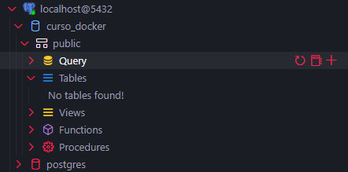
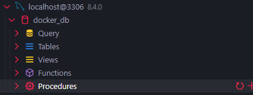
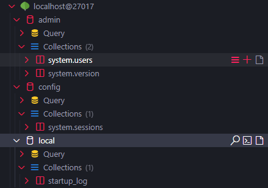

# Desafio de docker

- Para facilitar o teste das ferramentas eu criei um arquivo `makefile`, que executa scripts pre definidos com a seguinte estrutura `make <nome do script>`.

## Postgress

Para rodar o script de build do container execute:

```bash
make docker-postgress
```



## Mysql

Para rodar o script de build do container execute:

```bash
make docker-mysql
```



## MongoDB

Para rodar o script de build do container execute:

```bash
make docker-mysql
```


